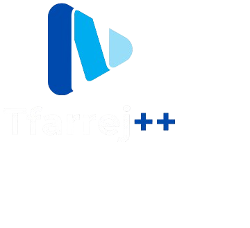

# Tfarrej - A Movie Streaming Website



Welcome to **Tfarrej**, a modern movie streaming website powered by the [TMDB API](https://www.themoviedb.org/) for fetching movie data and [Google API](https://developers.google.com/identity) for seamless sign-in integration. This project is the front-end implementation of Tfarrej, built using **Angular**, and integrates with a custom backend API hosted in the [Tfarrej Backend Repository](#).

## Features

- **Browse Movies**: View a collection of trending, latest, and highly-rated movies.
- **User Authentication**: Google Sign-In for a smooth user experience.
- **Movie Details**: View detailed information about movies, including ratings, descriptions, and trailers.
- **Personalization**: User profiles for managing watchlists and viewing history.
- **Responsive Design**: Optimized for desktops, tablets, and mobile devices.

## Live Demo

Explore the live version of Tfarrej here: [Tfarrej Frontend](https://tfarrej-frontend-pi.vercel.app/)

## Video Demo

Check out the video demonstration of Tfarrej: [Tfarrej Video Demo](https://drive.google.com/file/d/1GkM1wvjdtx7A4_q6TNidTgjn5aFGj6hK/view?usp=drive_link)

## Installation and Setup

Follow the steps below to set up and run the project locally:

### Prerequisites

- [Node.js](https://nodejs.org/) (v16 or above)
- [Angular CLI](https://angular.io/cli) (v15 or above)

### Steps

1. **Clone the Repository**
   ```bash
   git clone https://github.com/your-username/tfarrej-frontend.git
   cd tfarrej-frontend
   ```

2. **Install Dependencies**
   ```bash
   npm install
   ```

3. **Run the Project**
   ```bash
   ng serve
   ```
   The app will be accessible at `http://localhost:4200`.

### Build for Production

To create a production build of the application:
```bash
ng build --prod
```
The production-ready files will be located in the `dist/` folder.

## Backend Integration

Tfarrej’s frontend interacts with a custom backend API for handling movie data and user operations. Ensure the backend API is set up and running. You can find the backend repository here: [Tfarrej Backend Repository](https://github.com/your-username/tfarrej-backend)

## Technologies Used

- **Angular**: Frontend framework
- **TypeScript**: Programming language
- **TMDB API**: For fetching movie data
- **Google API**: For user authentication
- **Vercel**: For hosting the live demo

## Contributing

Contributions are welcome! To contribute:

1. Fork the repository.
2. Create a new branch: `git checkout -b feature-name`.
3. Commit your changes: `git commit -m 'Add some feature'`.
4. Push to the branch: `git push origin feature-name`.
5. Open a pull request.

## License

This project is licensed under the [MIT License](LICENSE).

---

Thank you for checking out Tfarrej! If you have any questions or feedback, feel free to reach out or open an issue in the repository.

